# 🤖 Agent-PromptSkills: 专业级 AI Agent 与 Skill 提示词工程体系 (V3.0)

> **构建人机协同的高阶数字化生产力骨架。** 本仓库集成并上线了 7 个核心专业级 AI Agent 角色，以及 18 个高度适配、开箱即用的配套专项 Skill（技能）配置文件，形成了一套工业级的全生命周期软件开发与量化投研设计规范。

---

## 🗺️ Agent-Skill 协同全景拓扑图 (V3.0)

以下展示了本体系中 7 大核心 Agent 与 18 个专项 Skill 之间的调用与编排关系：

```mermaid
graph TD
    classDef agent fill:#eef2ff,stroke:#4f46e5,stroke-width:2px;
    classDef skill fill:#f0fdf4,stroke:#16a34a,stroke-width:1px;
    
    CTO["🏛️ 企业4A架构师 (CTO)"]:::agent
    FE["🎨 前端专家"]:::agent
    BE["🔩 后端专家"]:::agent
    DE["📊 数据工程师"]:::agent
    QR["📈 量化研究员"]:::agent
    QA["🔍 QA 专家"]:::agent
    DO["🔄 DevOps 自动化与SRE专家"]:::agent
    NM["📱 新媒体运营专家"]:::agent
    VC["🎬 视频剪辑指导师"]:::agent

    %% CTO
    CTO --> SA1["🏢 business-architecture 业务架构"]:::skill
    CTO --> SA2["📱 application-architecture 应用架构"]:::skill
    CTO --> SA3["💾 data-architecture 数据架构"]:::skill
    CTO --> SA4["⚙️ technology-architecture 技术架构"]:::skill

    %% FE
    FE --> FE1["🎨 react-frontend-architecture 前端架构"]:::skill

    %% BE
    BE --> BE1["💾 database-engineering 数据库工程"]:::skill
    BE --> BE2["🔌 api-engineering API 工程"]:::skill
    BE --> BE3["🛡️ system-reliability 系统可靠性"]:::skill

    %% DE
    DE --> DE1["🔧 pipeline-engineering 管线工程"]:::skill
    DE --> DE2["✅ data-quality 数据质量"]:::skill
    DE --> DE3["🏗️ lakehouse-platform 数仓平台"]:::skill

    %% QR
    QR --> QR1["📈 factor-engineering 因子工程"]:::skill
    QR --> QR2["🚦 backtest-validation 回测验证"]:::skill
    QR --> QR3["⛏️ factor-mining 因子挖掘工作流"]:::skill

    %% QA
    QA --> QA1["🧪 test-evidence 测试证据"]:::skill
    QA --> QA2["🚦 quality-gate 质量门禁"]:::skill

    %% DO
    DO --> DO1["🚀 cicd-engineering CI/CD 工程"]:::skill
    DO --> DO2["🏗️ infrastructure-automation 基础设施自动化"]:::skill
    DO --> DO3["📡 observability-ops 可观测性运维"]:::skill

    %% NM
    NM --> NM1["🗞️ news-gathering 每日新闻收集"]:::skill
    NM --> NM2["📕 xhs-operation 小红书运营"]:::skill
    NM --> NM3["🎵 douyin-tiktok-operation 抖音/TikTok运营"]:::skill
    NM --> NM4["🟩 wechat-operation 微信公众号运营"]:::skill
    NM --> NM5["📺 bilibili-operation B站运营"]:::skill

    %% VC
    VC --> VC1["✂️ video-editing-direction 剪辑与视听指导"]:::skill
```



---

## 🗂️ Agent 角色与技能索引表 (V3.0)

本体系中的每个 Agent 都被赋予了鲜明的性格、专业记忆以及量化的成功指标，并支持按需激活其绑定的 Skills：

| Agent 角色 | 视觉主题 | 核心职责与使命 | 绑定的专项 Skills (技能) |
| :--- | :---: | :--- | :--- |
| **[🏛️ 企业4A架构师](./agents/4a-architect.md)** | `indigo` | 站在业务与技术交汇点，进行顶层数字化骨架设计与协同智能体统帅。 | `business-architecture`, `application-architecture`, `data-architecture`, `technology-architecture` |
| **[🎨 前端专家](./agents/frontend-engineer.md)** | `blue` | **React/UI-UX 资深架构师**。专精现代 React 19 生态、高保真视觉效果与 View Transitions 流畅动效。 | `react-frontend-architecture` |
| **[🔩 后端专家](./agents/backend-engineer.md)** | `slate` | **Go 微服务与 FastAPI 异步双强后端**。专精高并发并发控制、分布式锁处理、安全白名单硬化与可观测追踪。 | `database-engineering`, `api-engineering`, `system-reliability` |
| **[📈 量化研究员](./agents/quant-researcher.md)** | `green` | **Alpha 因子与历史无偏回测专家**。专精 Pandas 向量化高能运算、三大回测偏误防御与高逼真交易摩擦建模。 | `factor-engineering`, `backtest-validation`, `factor-mining` |
| **[📊 数据工程师](./agents/data-engineer.md)** | `orange` | **ClickHouse/MongoDB 数据专家**。设计并运维高吞吐、幂等的 ETL 数据管线，实现 Medallion 分层规范。 | `pipeline-engineering`, `data-quality`, `lakehouse-platform` |
| **[🔍 QA 专家](./agents/qa-engineer.md)** | `red` | **测试自动化与质量审计主关卡**。专精 Playwright 弹性定位 E2E 脚本、Pytest 数据隔离与 Locust 并发性能压测。 | `test-evidence`, `quality-gate` |
| **[🔄 DevOps 自动化与SRE专家](./agents/devops-engineer.md)** | `cyan` | **IaC 编排与站点可靠性专家**。专精极简多阶段 Docker 构建、Nginx 反向代理加固与磁盘容量自愈保护。 | `cicd-engineering`, `infrastructure-automation`, `observability-ops` |
| **[📱 新媒体运营专家](./agents/new-media-operator.md)** | `pink` | **全栈新媒体运营与内容营销专家**。精通全平台流量密码、爆款文案策划、热点网感捕捉与差异化分发。 | `news-gathering`, `xhs-operation`, `douyin-tiktok-operation`, `wechat-operation`, `bilibili-operation` |
| **[🎬 视频剪辑指导师](./agents/video-editing-coach.md)** | `purple` | **资深影视后期与视听语言导演**。专精短/中长视频分镜脚本、BPM 音乐卡点与完播率视觉特效优化。 | `video-editing-direction` |

---

## 🌟 V3.0 核心重构：架构解耦、技能充实与跨层协同网络

本仓库经历了严格的系统性审计，V3.0 版本实现了以下根本性工程升级：
1. **彻底充实核心技能**：
   - ⚛️ **前端范式演进**：`react-frontend-architecture` 全面拥抱 React Server Components (RSC)、Next.js App Router 与 Zustand 状态管理。
   - 🧮 **量化因子实战**：`factor-engineering` 新增 Factor Zoo 体系与纯向量化 Pandas/ClickHouse 代码示例。
   - 📉 **逼真回测引擎**：`backtest-validation` 新增 A 股 T+1 物理交割限制、过拟合诊断与基准对标指标。
2. **彻底的架构解耦 (DRY)**：消除 `system-reliability`、`technology-architecture`、`database-engineering` 等多个技能之间在部署、监控和高可用上的冗余复制，建立单一权威出处与轻量化交叉引用网络。
3. **全局跨 Agent 协同路由**：所有 6 个工程 Agent 的头部规范统一升级为标准 YAML Frontmatter，并在调度逻辑中注入了显式的 **跨 Agent 协同引擎**（例如：后端排障可联动数据工程师定位数仓分层问题）。

---

## 📊 深度量化投研与 ClickHouse 金融数仓适配

本体系中的 **量化研究员**、**数据工程师** 及其配套 Skills 经历了深度时序金融工程定制，完美对齐 **QuantAgents** 时序量化开发规范：

### 1. 阿尔法因子与历史无偏回测规范
*   **向量化矩阵运算**：严格杜绝 `for` 循环遍历 Panel 时序矩阵，全面推行 Pandas MultiIndex 向量化运算。
*   **严防回测三大偏误**：
    *   **未来函数（Lookahead Bias）**：严格进行时序平移 `.shift(1)`，确保交易信号完全基于历史数据。
    -   **幸存者偏差（Survivorship Bias）**：回测股票池动态加载，无缝兼容历史已退市股票。
    -   **公告日延迟（Announcement Delay）**：财务因子计算严格对接实际公告发布日（Announcement Date）而非季报结算日。
*   **高仿真交易摩擦**：内置 A 股标准印花税/佣金扣减标准，嵌入成交量上限 10% 流动性约束及滑点偏离算法。

### 2. ClickHouse 与 MongoDB 混合湖仓调优
*   **Medallion 四级数仓分层**：清晰划分 `ODS`（原始不可变） $\rightarrow$ `DWD`（清洗标准化，前复权物理表） $\rightarrow$ `DWS`（主题多维聚合，日/分钟 K 线） $\rightarrow$ `ADS`（策略因子与信号）四层。
*   **ClickHouse 时序表调优**：
    - 主推 `ReplacingMergeTree` + `ORDER BY` + `updated_at` 组合实现写入即去重和 Exactly-Once 语义。
    - 时序数据合理设置分区键（如 `toYYYYMM(trade_date)`）与冷热数据存储分离，提升千万级分钟 K 线查询效率。
*   **MongoDB 复合聚合管道调优**：
    - 聚合查询必须前置 `$match` 并走到复合索引路由，及早 `$project` 剔除无用列。
    - 强制配置磁盘临时使用 `{ allowDiskUse: true }`，防止 Pipeline 聚合处理时突破 100MB 物理内存上限。
*   **Redis Tick 时序流**：
    - 使用 Sorted Sets 存储毫秒级 Tick 更新（以时间戳为 score），支持滑动窗口低延迟读取。

---

## 🛠️ 如何在您的开发工具中使用

这套体系在主流的 AI 辅助开发工具（如 Cline, Windsurf, Cursor, Antigravity 等）中皆可展现出卓越效能。

### 1. 作为 Skill（技能）动态载入 (以 Antigravity/Cline 为例)
*   每个 Skill 文件夹均包含一个 `SKILL.md` 文件，其头部定义了标准的 YAML 声明：
    ```yaml
    ---
    name: api-engineering
    description: API 工程能力——REST/GraphQL/gRPC 接口设计与实现...
    ---
    ```
*   当系统识别到任务触发词（如“计算阿尔法因子”、“优化 MongoDB 聚合”、“设计 Docker 镜像”）时，AI 将自动调度并激活对应的专项 Skill。

### 2. 作为全局规则载入 (以 Cursor `.cursorrules` / `.windsurfrules` 为例)
您可以直接将对应 Agent 提示词文件（如 `agents/backend-engineer.md`）中的内容复制到您项目的全局配置规则中。

---

## 📜 许可证

本项目遵循 [MIT 许可证](./LICENSE) 开源。
