# 🤖 Agent-PromptSkills: 专业级 AI Agent 与 Skill 提示词工程体系

> **构建人机协同的高阶数字化生产力骨架。** 本仓库记录了 5 个核心专业级 AI Agent 角色，以及 15 个高度适配、开箱即用的配套专项 Skill（技能）配置文件，形成了一套完整的软件生命周期开发与设计规范。

---

## 🗺️ Agent-Skill 协同全景拓扑图

以下展示了本体系中 5 大核心 Agent 与 15 个专项 Skill 之间的调用与编排关系：

```mermaid
graph TD
    classDef agent fill:#eef2ff,stroke:#4f46e5,stroke-width:2px;
    classDef skill fill:#f0fdf4,stroke:#16a34a,stroke-width:1px;
    
    CTO["🏛️ 企业4A架构师 (CTO)"]:::agent
    BE["🔩 后端工程师"]:::agent
    DE["📊 数据工程师"]:::agent
    QA["🔍 QA 工程师"]:::agent
    DO["🔄 DevOps 自动化师"]:::agent

    %% CTO Skills
    CTO --> SA1["🏢 business-architecture 业务架构"]:::skill
    CTO --> SA2["📱 application-architecture 应用架构"]:::skill
    CTO --> SA3["💾 data-architecture 数据架构"]:::skill
    CTO --> SA4["⚙️ technology-architecture 技术架构"]:::skill

    %% BE Skills
    BE --> BE1["💾 database-engineering 数据库工程"]:::skill
    BE --> BE2["🔌 api-engineering API 工程"]:::skill
    BE --> BE3["🛡️ system-reliability 系统可靠性"]:::skill

    %% DE Skills
    DE --> DE1["🔧 pipeline-engineering 管线工程"]:::skill
    DE --> DE2["✅ data-quality 数据质量"]:::skill
    DE --> DE3["🏗️ lakehouse-platform 数仓平台"]:::skill

    %% QA Skills
    QA --> QA1["🧪 test-evidence 测试证据"]:::skill
    QA --> QA2["🚦 quality-gate 质量门禁"]:::skill

    %% DevOps Skills
    DO --> DO1["🚀 cicd-engineering CI/CD 工程"]:::skill
    DO --> DO2["🏗️ infrastructure-automation 基础设施自动化"]:::skill
    DO --> DO3["📡 observability-ops 可观测性运维"]:::skill
```



---

## 🗂️ Agent 角色与技能索引表

本体系中的每个 Agent 都被赋予了鲜明的性格、专业记忆以及量化的成功指标，并支持按需激活其绑定的 Skills：

| Agent 角色 | 视觉主题 | 核心职责与使命 | 绑定的专项 Skills (技能) |
| :--- | :---: | :--- | :--- |
| **[🏛️ 企业4A架构师](./agents/4a-architect.md)** | `indigo` | 站在业务与技术交汇点，进行顶层数字化骨架设计，涵盖业务流梳理、限界上下文定义、存储选型及基础设施规划。 | `business-architecture`, `application-architecture`, `data-architecture`, `technology-architecture` |
| **[🔩 后端工程师](./agents/backend-engineer.md)** | `slate` | 将架构蓝图落地为高性能、安全、可维护的生产代码。负责 Schema 设计、API 契约编写、慢查询调优与安全加固。 | `database-engineering`, `api-engineering`, `system-reliability` |
| **[📊 数据工程师](./agents/data-engineer.md)** | `orange` | **ClickHouse 金融数仓适配版**。设计并运维高吞吐、强一致性的数据流，支持量化投研的多层分层与生命周期管理。 | `pipeline-engineering`, `data-quality`, `lakehouse-platform` |
| **[🔍 QA 工程师](./agents/qa-engineer.md)** | `red` | 零容忍证据缺失，默认怀疑一切声明。集 Bug 证据链审计与系统发版、部署就绪性评估于一体，守门生产质量。 | `test-evidence`, `quality-gate` |
| **[🔄 DevOps 自动化师](./agents/devops-engineer.md)** | `cyan` | 基础设施即代码（IaC）专家。设计 CI/CD 自动化流水线，实施无感部署与快速回滚，构建主动式可观测性防御体系。 | `cicd-engineering`, `infrastructure-automation`, `observability-ops` |

---

## 📊 数据工程师 ClickHouse 金融数仓专项适配

本体系中的 **数据工程师 (Data Engineer)** 及其配套 Skill 经历了深度行业定制，完美契合量化投研场景及 **QuantAgents** 的开发规范：

*   **Medallion 四级数仓分层**：严格遵循 `ODS`（原始不可变） $\rightarrow$ `DWD`（清洗标准化，前复权物理表） $\rightarrow$ `DWS`（主题多维聚合，日/分钟 K 线） $\rightarrow$ `ADS`（策略因子与信号）规范，禁止跨层访问。
*   **ClickHouse 生产调优**：
    *   主推 `ReplacingMergeTree` + `ORDER BY` + `updated_at` 组合实现写入即去重和 Exactly-Once 语义。
    *   时序数据合理设置分区键（如 `toYYYYMM(trade_date)`）与冷热数据存储分离，提升千万级分钟 K 线查询效率。
    *   以 `ELT` 思想为主：Python 只负责轻量化采集并推送至 ODS，核心清洗与聚合转由 ClickHouse 内部 SQL 向量化执行。
*   **多源异构 API 接入**：无缝对接 `Tushare`、`AmazingData (1分钟行情/龙虎榜)`、`AKShare` 等量化数据接口。
*   **D0-D10 业务数据域**：科学覆盖主数据、行情、财务、资金、情绪、舆情、事件、行业板块、复盘、因子值、策略信号等量化核心域。

---

## 🛠️ 如何在您的开发工具中使用

这套体系在主流的 AI 辅助开发工具（如 Cline, Windsurf, Cursor, Antigravity 等）中皆可展现出卓越效能。

### 1. 作为 Skill（技能）动态载入 (以 Antigravity/Cline 为例)
*   每个 Skill 文件夹均包含一个 `SKILL.md` 文件，其头部定义了标准的 YAML 声明：
    ```yaml
    ---
    name: api-engineering
    description: API 工程能力——REST/GraphQL/gRPC 接口设计与实现...
    ---
    ```
*   当系统识别到任务触发词（如“设计数据库表”、“优化慢 SQL”或“编写 CI 脚本”）时，AI 将自动调度并激活对应的专项 Skill，加载其中的约束与最佳实践指南。

### 2. 作为全局规则载入 (以 Cursor `.cursorrules` / `.windsurfrules` 为例)
如果您希望在整个项目中赋予 AI 某个角色的灵魂与规范，可以将对应的 Agent 提示词文件（如 `agents/backend-engineer.md`）中的内容复制到您项目的全局配置规则中。

---

## 📜 许可证

本项目遵循 [MIT 许可证](./LICENSE) 开源。
