# Agent-PromptSkills：专业级 AI Agent 与 Skill 提示词工程体系

> **构建人机协同的高阶数字化生产力骨架。** 本仓库集成 **11 个核心专业级 AI Agent 角色**（含业务 PMO / 推进官、4A 架构师、量化 Lead + 4 个研究领域 Agent）与 **45+ 个高度适配、开箱即用的配套 Skill 配置文件**，外加 `/pm` 命令入口、**10 步标准生命周期 + 派工体系 2.0（L1/L2 级联 + dispatch md 落盘）** hook、3 份组织治理 ADR 与 4 份 standards 权威源，形成工业级的全生命周期软件开发与量化投研设计规范。

---

## 多 Agent 团队架构

- 导航：[`docs/standards/AGENT_ORG_INDEX.md`](docs/standards/AGENT_ORG_INDEX.md) —— 5 类文件清单 + 启动顺序 + 引用关系图
- 派工权威源：[`agents/ROUTING.md`](agents/ROUTING.md) —— 派工硬约束 + Agent × Skill 路由矩阵
- 团队搭建方法论：[`docs/standards/multi-agent-team-bootstrap.md`](docs/standards/multi-agent-team-bootstrap.md) —— 13 步 bootstrap 流程 + 5 个 prompt 模板 + **10 步标准生命周期** 推进机制
- 4A 治理：[`docs/standards/architecture-collaboration-workflow.md`](docs/standards/architecture-collaboration-workflow.md)
- 派工引擎路由：[`.claude/skills/pm-engine/SKILL.md`](.claude/skills/pm-engine/SKILL.md) —— 4A / 前端切换 CC / Codex / Gemini / Antigravity

### /pm 命令与 10 步推进链路（**派工体系 2.0：L1/L2 级联**）

- `/pm` 入口：[`.claude/commands/pm.md`](.claude/commands/pm.md) —— 业务侧唯一对话接口，激活 PMO 推进官模式
- **10 步标准生命周期**：brainstorming → 拆分 L1 派工 → writing-plans → /autoplan → 派 L2 → TDD → debugging → /qa → code-review → /ship & /cso
- **L1/L2 派工**：详见 [`docs/dispatch/PROTOCOL.md`](docs/dispatch/PROTOCOL.md) —— PM 派 L1 给 Lead 写方案 → Lead 落 `docs/solutions/<id>.md` → PM 派 L2 给 IC（**必填** `solution_ref`）
- 派工 4 动作 + 状态链：详见 [`docs/standards/agent-delivery-responsibility-routing.md` §8](docs/standards/agent-delivery-responsibility-routing.md)
- 10 步 PreToolUse 拦截：[`.claude/hooks/check-9step.sh`](.claude/hooks/check-9step.sh) —— 非例行 git commit 强制要求 `docs/tasks/<branch>.md` 含 10 步 checklist
- 10 步 plan 模板：[`docs/tasks/_template.md`](docs/tasks/_template.md)

### 派工引擎路由（4A / 前端，v2.0 交互式菜单）

- Skill 入口：[`.claude/skills/pm-engine/SKILL.md`](.claude/skills/pm-engine/SKILL.md) —— 交互式菜单切换 4A 架构师 / 前端 Agent 派工引擎（CC / Codex / Gemini / Antigravity）
- 状态文件：`.claude/engine-config.json`（不存在则全部默认 cc）
- 触发方式：调用 `/pm-engine` 后由 `AskUserQuestion` 弹出二级菜单（操作类型 → 引擎选择），无需手敲命令
- 引擎矩阵：4A → `cc` / `codex`；前端 → `cc` / `gemini` / `agy`
- 4A 自身架构评审 / ADR 撰写 / 跨域评审**不**受引擎路由影响（始终由 4A 自己做）

---

## 公司组织架构（团队 × Agent 树）

本 AI 团队按业务方向划分为 **3 个团队**、11 个 Agent。**数据工程师** 跨团队服务（研发平台 + 量化湖仓 + 新媒体业务），以虚线样式标注。

> **本仓库当前 11 个核心 Agent**：业务 PMO（推进官）→ 4A 架构师（技术 Lead）→ 后端 / 前端 / 数据 / QA / DevOps 专家（IC）；量化 Lead → 4 个研究领域 Agent（china-market / factor / news-social / strategy）→ 数据工程师（共享）；新媒体运营专家 → 视频剪辑指导师。

```mermaid
graph TB
    classDef root fill:#fef3c7,stroke:#d97706,stroke-width:3px,color:#92400e;
    classDef team fill:#eef2ff,stroke:#4f46e5,stroke-width:2px,color:#312e81;
    classDef member fill:#f0fdf4,stroke:#16a34a,stroke-width:1px,color:#14532d;
    classDef shared fill:#fce7f3,stroke:#be185d,stroke-width:2px,color:#831843,stroke-dasharray: 5 5;

    ROOT["🏢 Agent-PromptSkills<br/>企业级 AI 团队"]:::root

    ROOT --> RD["🏛️ 研发团队<br/>R&D · 通用工程"]:::team
    ROOT --> QT["📈 量化团队<br/>Quant · 投研"]:::team
    ROOT --> MT["📱 新媒体团队<br/>New Media · 内容运营"]:::team

    RD --> A1["🏛️ 4A 架构师<br/>顶层设计 + ADR"]:::member
    RD --> A2["🎨 前端专家<br/>React 19 / 状态 / 动效"]:::member
    RD --> A3["🔩 后端专家<br/>Go / FastAPI / 高并发"]:::member
    RD --> A4["🔍 QA 专家<br/>E2E / 压测 / 质量门禁"]:::member
    RD --> A5["🔄 DevOps / SRE 专家<br/>CI/CD / IaC / 可观测"]:::member

    QT --> Q0["📈 量化策略研究员<br/>决策层 Lead"]:::member
    QT --> L1["数据层 (1)<br/>数据工程师 (共享)"]:::member
    QT --> L2["研究层 (3 并行)<br/>因子 / 舆情 / A股技术"]:::member
    QT --> L3["决策层 (1)<br/>策略研究员 = 5 项必含 + 风控否决"]:::member
    QT -.-> A7["📊 数据工程师<br/>湖仓 / ETL / 跨业务供数"]:::shared

    MT --> A8["📱 新媒体运营专家<br/>全平台内容 / 流量"]:::member
    MT --> A9["🎬 视频剪辑指导师<br/>分镜 / 视听 / 完播率"]:::member
```



> **量化团队 5 角色详情**（精简自 TradingAgents 风格）：[完整 3 层图谱见 `./agents/quant/quant-strategy-researcher.md`](./agents/quant/quant-strategy-researcher.md#3-层派工图谱)。

### 团队职责边界

| 团队 | 核心定位 | Agent 列表 |
| :--- | :--- | :--- |
| **🏛️ 研发团队** | 通用工程：产品 / 平台 / 质量 / 运维一站式 | 4A 架构师、前端专家、后端专家、QA 专家、DevOps/SRE 专家 |
| **📈 量化团队** | 量化投研：3 层 5 角色（数据→研究→决策） | 量化策略研究员（决策层 Lead）、<span style="color:#4f46e5">**5 角色**</span>：1 数据 + 3 研究 + 1 决策、<span style="color:#be185d">数据工程师（共享）</span> |
| **📱 新媒体团队** | 内容运营：全平台流量 / 视频剪辑 | 新媒体运营专家、视频剪辑指导师、<span style="color:#be185d">数据工程师（共享）</span> |

> **跨团队派工原则**：4A 架构师对所有跨域变更负评审责任（详见 [`docs/standards/architecture-collaboration-workflow.md`](./docs/standards/architecture-collaboration-workflow.md)）。

### 量化团队 5 角色展开

| 层级 | 角色 | 提示词路径 | 核心职责 |
| :--- | :--- | :--- | :--- |
| **工程入口** | 量化 Lead | [`./agents/quant-lead.md`](./agents/quant-lead.md) | 业务 Lead 模式（接 PM 派工 → 写四件套 → 派 4A）+ 执行模式（4A 派回时跑因子工程 / 回测 / IC 评估）|
| **决策层** | 量化策略研究员 | [`./agents/quant/quant-strategy-researcher.md`](./agents/quant/quant-strategy-researcher.md) | 多信号联合优化 + 风险模型 + 5 项必含交易计划 + 货币识别（A 股/港股/美股）|
| **研究层** | 因子研究员 | [`./agents/quant/quant-factor-researcher.md`](./agents/quant/quant-factor-researcher.md) | 基本面 4 类策略 + 财务多维 + IC/IR 评估 + 多空因子视角 + 向量化防偏误 |
| **研究层** | 新闻舆情分析师 | [`./agents/quant/quant-news-social-analyst.md`](./agents/quant/quant-news-social-analyst.md) | 5 类新闻舆情策略 + A 股社媒情绪（雪球/股吧/同花顺）+ news_report + sentiment_report |
| **研究层** | A股市场分析师 | [`./agents/quant/quant-china-market-analyst.md`](./agents/quant/quant-china-market-analyst.md) | 11 类 A 股技术策略 + 量价位置阶段 + 三段式结论（支持/反对/等待） |
| **数据层** | 数据工程师（共享） | [`./agents/data-engineer.md`](./agents/data-engineer.md) | Medallion / 行情 / 基本面 / 另类数据 / DQC；为量化与新媒体双线业务供数 |

> **架构决策见** [`docs/adr/0003-quant-team-merge.md`](docs/adr/0003-quant-team-merge.md) —— quant-lead 与 4 个研究领域 Agent 并行存在，工程入口 + 研究流水线完整覆盖。

**配套策略文件**：[`./skills/trading-strategies/`](./skills/trading-strategies/) 6 个 .md（fundamental / technical / news_social / research_manager / risk_trader / global_macro），由对应 Agent 必读。

---

## Agent-Skill 协同全景拓扑图

以下展示本体系中 9 大核心 Agent（含量化团队展开为 5 子角色）与其他专项 Skill 之间的调用与编排关系：

```mermaid
graph TD
    classDef agent fill:#eef2ff,stroke:#4f46e5,stroke-width:2px;
    classDef skill fill:#f0fdf4,stroke:#16a34a,stroke-width:1px;

    CTO["🏛️ 4A 架构师"]:::agent
    FE["🎨 前端专家"]:::agent
    BE["🔩 后端专家"]:::agent
    DE["📊 数据工程师"]:::agent
    QR["📈 量化策略研究员"]:::agent
    QA["🔍 QA 专家"]:::agent
    DO["🔄 DevOps / SRE 专家"]:::agent
    NM["📱 新媒体运营专家"]:::agent
    VC["🎬 视频剪辑指导师"]:::agent

    %% 4A 架构师
    CTO --> BA["🏢 business-architecture 业务架构"]:::skill
    CTO --> AA["📱 application-architecture 应用架构"]:::skill
    CTO --> DA["💾 data-architecture 数据架构"]:::skill
    CTO --> TA["⚙️ technology-architecture 技术架构"]:::skill

    %% 前端专家
    FE --> RFA["⚛️ react-frontend-architecture 前端架构"]:::skill

    %% 后端专家
    BE --> DBE["💾 database-engineering 数据库工程"]:::skill
    BE --> APE["🔌 api-engineering API 工程"]:::skill
    BE --> SRE["🛡️ system-reliability 系统可靠性"]:::skill

    %% 数据工程师
    DE --> DA["💾 data-architecture 数据架构"]:::skill
    DE --> PE["🔧 pipeline-engineering 管线工程"]:::skill
    DE --> DQ["✅ data-quality 数据质量"]:::skill
    DE --> LP["🏗️ lakehouse-platform 数仓平台"]:::skill

    %% 量化策略研究员
    QR --> FE_SK["📈 factor-engineering 因子工程"]:::skill
    QR --> BV["🚦 backtest-validation 回测验证"]:::skill
    QR --> FM["⛏️ factor-mining 因子挖掘工作流"]:::skill

    %% QA 专家
    QA --> TE["🧪 test-evidence 测试证据"]:::skill
    QA --> QG["🚦 quality-gate 质量门禁"]:::skill

    %% DevOps / SRE 专家
    DO --> CI["🚀 cicd-engineering CI/CD 工程"]:::skill
    DO --> IA["🏗️ infrastructure-automation 基础设施自动化"]:::skill
    DO --> OO["📡 observability-ops 可观测性运维"]:::skill

    %% 新媒体运营专家
    NM --> NG["🗞️ news-gathering 新闻采集与洞察"]:::skill
    NM --> XHS["📕 xhs-operation 小红书运营"]:::skill
    NM --> DYT["🎵 douyin-tiktok-operation 抖音/TikTok 运营"]:::skill
    NM --> WX["🟩 wechat-operation 微信公众号运营"]:::skill
    NM --> BILI["📺 bilibili-operation B 站运营"]:::skill
    NM --> ASR["📝 video-transcript-copywriting 视频字幕与文案加工"]:::skill

    %% 视频剪辑指导师
    VC --> VED["✂️ video-editing-direction 剪辑与视听指导"]:::skill
```



---

## Agent 角色索引表

| Agent 角色 | 核心职责与使命 | 绑定的专项 Skill |
| :--- | :--- | :--- |
| **[🧭 业务 PMO / 推进官](./agents/pm.md)** | 业务侧唯一入口，3 角色合一：PMO 进度跟踪 + **需求分流与派工官**（L1 派 Lead / L2 派 IC）+ 推进官（持续催 10 步进度 / 卡时升级 / 跨 Lead 协调） | `brainstorming`, `writing-plans`, `business-architecture`(只读) |
| **[📈 量化 Lead](./agents/quant-lead.md)** | 量化业务侧 Lead（写四件套 → 派 4A 评审）+ 因子工程执行者（4A 派回时写因子 / 回测 / IC 评估）| `factor-engineering`, `backtest-validation`, `factor-mining` |
| **[🏛️ 4A 架构师](./agents/4a-architect.md)** | 站在业务与技术交汇点，进行顶层数字化骨架设计与协同智能体统帅 | `business-architecture`, `application-architecture`, `data-architecture`, `technology-architecture` |
| **[🎨 前端专家](./agents/frontend-engineer.md)** | React / UI-UX 资深架构师，专精 React 19 生态、高保真视觉效果与 View Transitions 流畅动效 | `react-frontend-architecture` |
| **[🔩 后端专家](./agents/backend-engineer.md)** | Go 微服务与 FastAPI 异步双强后端，专精高并发控制、分布式锁、可观测追踪 | `database-engineering`, `api-engineering`, `system-reliability` |
| **[📈 量化策略研究员](./agents/quant/quant-strategy-researcher.md)** | 量化业务侧 Lead + 决策层核心；多信号联合优化、风险模型、5 项必含交易计划、货币识别 | `factor-engineering`, `backtest-validation`, `factor-mining` + 6 个 [`./skills/trading-strategies/`](./skills/trading-strategies/) 策略文件 |
| **[📊 数据工程师](./agents/data-engineer.md)** | 多模存储与数据治理专家，覆盖行情 / 基本面 / 另类数据全生命周期，设计 Medallion 分层与多级缓存体系，为量化与新媒体双线业务供数 | `data-architecture`, `pipeline-engineering`, `data-quality`, `lakehouse-platform` |
| **[🔍 QA 专家](./agents/qa-engineer.md)** | 测试自动化与质量审计主关卡，专精 Playwright E2E、Pytest 数据隔离、Locust 性能压测 | `test-evidence`, `quality-gate` |
| **[🔄 DevOps / SRE 专家](./agents/devops-engineer.md)** | IaC 编排与站点可靠性专家，专精极简多阶段 Docker、Nginx 加固、磁盘容量自愈 | `cicd-engineering`, `infrastructure-automation`, `observability-ops` |
| **[📱 新媒体运营专家](./agents/new-media-operator.md)** | 全栈新媒体运营与内容营销专家，精通全平台流量密码、爆款文案、热点网感捕捉 | `news-gathering`, `xhs-operation`, `douyin-tiktok-operation`, `wechat-operation`, `bilibili-operation`, `video-transcript-copywriting` |
| **[🎬 视频剪辑指导师](./agents/video-editing-coach.md)** | 资深影视后期与视听语言导演，专精分镜脚本、BPM 卡点、完播率视觉优化 | `video-editing-direction` |

---

## 协同治理权威文档

涉及 4A 架构协同、交付角色分派、agent 提示词最小硬约束和**多 Agent 团队搭建方法论**时，以以下文档为准：

- `docs/standards/architecture-collaboration-workflow.md`
- `docs/standards/agent-delivery-responsibility-routing.md`
- `docs/standards/multi-agent-team-bootstrap.md` ← **团队搭建方法论权威源**（13 步流程 + 派工矩阵 + 5 个标准模板）
- `docs/standards/AGENT_ORG_INDEX.md` ← **5 类文件清单 + 启动顺序 + 引用关系图**（推荐先读）
- `docs/adr/0001-4a-collaboration-baseline.md`
- `docs/adr/0002-agent-delivery-responsibility-routing.md`
- `docs/adr/0003-quant-team-merge.md` ← **量化团队架构**（quant-lead 工程入口 + 4 研究领域 Agent 并行）

其中职责路由的关键口径为：

- `frontend-engineer`：页面、组件、路由、状态管理、交互和视图层问题
- `backend-engineer`：API、调度平台能力、权限审计、服务编排
- `data-engineer`：采集任务、ETL/ELT、数仓、DQC、指标 / 因子 / Ins
- `devops-engineer`：部署、监控、回滚、IaC、CI/CD
- `qa-engineer`：测试设计、执行证据、发布建议

---

## 文档格式规范（V2.0）

本仓库 V2.0 全面升级为 **Audience-Based Language Strategy**（受众分层语言策略），所有 Agent 与 Skill 文件遵循统一的 Markdown 结构与语言分层。

### 1. 受众分层语言原则

| 层级 | 受众 | 语言策略 |
| :--- | :--- | :--- |
| **YAML description** | Claude 模型（路由决策） | 中文短句，使用「用于以下场景：」+ 触发关键词，控制在 500 字符内 |
| **Markdown 正文** | 人类开发者 + Claude 模型（执行） | 中文叙述 + 英文技术术语（如 ReplacingMergeTree、`partition by`、IC、IR） |
| **代码块** | 运行时（Python / SQL / Go / Nginx） | 纯英文代码，技术词与变量名保持英文 |

**核心理念：**

- **description 只描述触发条件，不总结工作流**——避免 Claude 走捷径跳过正文。
- **正文用中文解释"为什么"，用英文保留"是什么"**——技术名词的精确性高于翻译流畅性。
- **代码与配置保持英文**——避免运行时解析错误。

### 2. 文件结构（V2.0 标准模板）

**Agent 文件结构：**

```text
1. YAML frontmatter（name + description）
2. 身份与定位（Identity）
3. 核心使命（Core Mission）
4. 何时调度（When to Dispatch）
5. 关键规则（Key Rules）
6. 技能路由（Skill Routing）
7. 工程约束（Engineering Constraints）
8. 代码审查清单（Code Review Checklist）
9. 成功指标（Success Metrics）
10. 沟通风格（Communication Style）
```

**Skill 文件结构：**

```text
1. YAML frontmatter（name + description）
2. 概述（Overview）
3. 何时使用（When to Use）
4. 速查表（Quick Reference）
5. 核心规则（Core Rules）
6. 常见错误（Common Mistakes）
7. 产出物清单（Deliverables Checklist）
```

### 3. 表格优先原则

**V2.0 强约束：** 所有对比、清单、矩阵、参数选项必须使用 Markdown 表格，禁止使用嵌套项目符号或大段文字罗列。

| 替代 | 说明 |
| :--- | :--- |
| ❌ 多层缩进项目符号对比 | 嵌套超过 2 层即丢失可扫描性 |
| ✅ 表格 | 一眼扫读，便于 Claude 与人类共同解析 |

---

## Skill 体系完整索引

### 🏛️ 架构层

| Skill | 核心能力 | 主调度 Agent |
| :--- | :--- | :--- |
| [business-architecture](./skills/business-architecture/SKILL.md) | 业务架构、能力分层、价值流、康威定律 | 4A 架构师 |
| [application-architecture](./skills/application-architecture/SKILL.md) | DDD、CQRS、BFF、Strangler Fig、ADR | 4A 架构师 |
| [data-architecture](./skills/data-architecture/SKILL.md) | Medallion 分层、五大存储选型、数据契约 | 4A 架构师 |
| [technology-architecture](./skills/technology-architecture/SKILL.md) | SLI/SLO/SLA、容量规划、弹性设计、反模式 | 4A 架构师 |

### 💻 工程层

| Skill | 核心能力 | 主调度 Agent |
| :--- | :--- | :--- |
| [react-frontend-architecture](./skills/react-frontend-architecture/SKILL.md) | React 19 RSC、Zustand、TanStack Query、WCAG | 前端专家 |
| [api-engineering](./skills/api-engineering/SKILL.md) | REST/GraphQL/gRPC 设计、版本管理、契约 | 后端专家 |
| [database-engineering](./skills/database-engineering/SKILL.md) | Schema 索引、查询优化、零停机迁移、缓存 | 后端专家 |
| [system-reliability](./skills/system-reliability/SKILL.md) | Go 并发、Redis 锁、安全加固、负载测试 | 后端专家 |

### 📊 数据层

| Skill | 核心能力 | 主调度 Agent |
| :--- | :--- | :--- |
| [pipeline-engineering](./skills/pipeline-engineering/SKILL.md) | 采集脚本、ODS→DWD→DWS→ADS、幂等写入 | 数据工程师 |
| [data-quality](./skills/data-quality/SKILL.md) | 数据契约、五大维度、三级门禁、告警分级 | 数据工程师 |
| [lakehouse-platform](./skills/lakehouse-platform/SKILL.md) | ClickHouse 引擎选型、分区索引、冷热分离 | 数据工程师 |

### 📈 量化层

| Skill | 核心能力 | 主调度 Agent |
| :--- | :--- | :--- |
| [factor-engineering](./skills/factor-engineering/SKILL.md) | 因子分类、向量化、MAD 去极值、IC 评估 | 量化研究员 |
| [factor-mining](./skills/factor-mining/SKILL.md) | AI 节点工作流、ML 非线性特征、复合因子 | 量化研究员 |
| [backtest-validation](./skills/backtest-validation/SKILL.md) | A 股 T+1、涨跌停、四大偏误、滑点建模 | 量化研究员 |
| [quant-alpha-zoo](./skills/quant-alpha-zoo/SKILL.md) | 经典 Alpha 因子库数学公式、Pandas 向量化计算标准 | 量化研究员 |
| [candlestick-pattern](./skills/candlestick-pattern/SKILL.md) | K 线实体影线特征量化、20 种形态高精度识别 | 量化研究员 |
| [earnings-revision](./skills/earnings-revision/SKILL.md) | 分析师一致预期修正比例、超预期幅度 (SUE) 财报分析 | 量化研究员 |
| [options-strategy](./skills/options-strategy/SKILL.md) | BS 期权定价模型、希腊字母 (Greeks) 对冲策略 | 量化策略研究员 |
| [onchain-analysis](./skills/onchain-analysis/SKILL.md) | 加密货币交易所净流量 (NEF)、巨鲸持仓、TVL 监测 | 量化策略研究员 |
| [trading-strategies/](./skills/trading-strategies/) | 6 个策略知识包（基本面/技术/舆情/裁决/风控交易/全球宏观），5 角色量化团队必读 | 量化团队 5 角色 |

### 🛡️ 质量与运维层

| Skill | 核心能力 | 主调度 Agent |
| :--- | :--- | :--- |
| [test-evidence](./skills/test-evidence/SKILL.md) | Playwright E2E、Pytest 隔离、Bug 报告 | QA 专家 |
| [quality-gate](./skills/quality-gate/SKILL.md) | Locust 压测门禁、E2E 验证、A/B/C/D 评级 | QA 专家 |
| [cicd-engineering](./skills/cicd-engineering/SKILL.md) | 蓝绿 / 金丝雀、灰度发布、回滚方案 | DevOps 专家 |
| [infrastructure-automation](./skills/infrastructure-automation/SKILL.md) | Docker Distroless、Terraform、K8s 探针 | DevOps 专家 |
| [observability-ops](./skills/observability-ops/SKILL.md) | Nginx 加固、SRE 日志滚动、告警 Runbook | DevOps 专家 |

### 📱 新媒体层

| Skill | 核心能力 | 主调度 Agent |
| :--- | :--- | :--- |
| [news-gathering](./skills/news-gathering/SKILL.md) | 热点捕捉、行业聚合、情绪提炼、晨报 | 新媒体专家 |
| [xhs-operation](./skills/xhs-operation/SKILL.md) | 小红书爆款公式、SEO 埋词、Tag 策略 | 新媒体专家 |
| [douyin-tiktok-operation](./skills/douyin-tiktok-operation/SKILL.md) | 黄金 3 秒钩子、算法漏斗、BGM 卡点 | 新媒体专家 |
| [wechat-operation](./skills/wechat-operation/SKILL.md) | 长图文、私域沉淀、社交货币、裂变诱饵 | 新媒体专家 |
| [bilibili-operation](./skills/bilibili-operation/SKILL.md) | 中长视频结构、弹幕造梗、三连引导 | 新媒体专家 |
| [video-transcript-copywriting](./skills/video-transcript-copywriting/SKILL.md) | ASR 自动转写、视频字幕提取、文案提炼与二次加工 | 新媒体专家 |
| [video-editing-direction](./skills/video-editing-direction/SKILL.md) | 分镜脚本、A/B-roll、BPM 卡点、画幅安全区 | 视频剪辑师 |

### ⚡ Superpowers 流程与开发规范层

*注：Superpowers 系列 Skill 作为通用的 AI 编程与工作流规范层，无需显式硬编码到特定 Agent，可在支持 Skill 调度的 Agent 平台（如 Claude Code、Cursor、Gemini CLI 等）作为全局过程规范加载。*

| Skill | 核心能力 | 适用场景 |
| :--- | :--- | :--- |
| [using-superpowers](./skills/using-superpowers/SKILL.md) | 引导启动与 Skill 调度规则，开启 AI 规范化开发流程 | 所有 Agent 启动与交互时 |
| [brainstorming](./skills/brainstorming/SKILL.md) | 苏格拉底式脑暴与需求深度剖析，预防方向性错误 | 任务立项与方案讨论前 |
| [writing-plans](./skills/writing-plans/SKILL.md) | 编写微任务执行计划，划分文件职责与架构 | 需求设计与编码前 |
| [executing-plans](./skills/executing-plans/SKILL.md) | 计划执行、步骤追踪与状态记录 | 编码与计划落地时 |
| [test-driven-development](./skills/test-driven-development/SKILL.md) | 测试驱动开发 (TDD) 规范，红-绿-重构循环 | 所有业务代码编写 |
| [systematic-debugging](./skills/systematic-debugging/SKILL.md) | 系统化调试、根因追踪与重现用例编写 | Bug 修复与异常排查 |
| [verification-before-completion](./skills/verification-before-completion/SKILL.md) | 完成前自动化门禁与人工确认，防止带病交付 | 任务交付前 |
| [subagent-driven-development](./skills/subagent-driven-development/SKILL.md) | 子智能体（Subagent）拆分协同研发与 Code Review | 复杂大任务拆分开发 |
| [dispatching-parallel-agents](./skills/dispatching-parallel-agents/SKILL.md) | 并行智能体协作与并发控制 | 大规模任务并发处理 |
| [requesting-code-review](./skills/requesting-code-review/SKILL.md) | 发起代码审查、PR 规范化自检 | 提交流水线前 |
| [receiving-code-review](./skills/receiving-code-review/SKILL.md) | 接收与响应代码审查反馈，执行闭环重构 | 接收 Review 意见时 |
| [using-git-worktrees](./skills/using-git-worktrees/SKILL.md) | 使用 Git Worktree 独立开发，保持主工作区干净 | 多任务并行、分支隔离 |
| [finishing-a-development-branch](./skills/finishing-a-development-branch/SKILL.md) | 研发分支合并、测试用例回归与临时分支清理 | 功能开发合并时 |
| [writing-skills](./skills/writing-skills/SKILL.md) | 编写与迭代 AI Agent 专项 Skill 的最佳实践 | 自定义 Skill 扩充 |
| [swarm-dag-orchestration](./skills/swarm-dag-orchestration/SKILL.md) | 多智能体 Swarm 团队配置与 Task DAG 工作流有向图编排 | 量化与复合业务派工时 |
| [agent-self-evolution](./skills/agent-self-evolution/SKILL.md) | 智能体回测/评估失败后的反思与规避指令自适应优化 | 校验失败被拒或指标不达标时 |

### 📋 流程与治理辅助层

| 文件 | 用途 | 适用场景 |
| :--- | :--- | :--- |
| [`.claude/commands/pm.md`](.claude/commands/pm.md) | `/pm` 命令入口 | 用户所有需求的第一承接点 |
| [`.claude/hooks/check-9step.sh`](.claude/hooks/check-9step.sh) | 10 步链路 PreToolUse 拦截 hook | 非例行 git commit 强制要求 plan 文件 |
| [`docs/tasks/_template.md`](docs/tasks/_template.md) | 10 步 plan 模板 | 复制 → 填具体内容 → 按 10 步推进 |

### 🏗️ 团队搭建层

*注：团队搭建层将本仓库的 Agent + Skill 体系**打包成可一键复用的方法论**，用于在新项目里按 13 步流程从 0 跑通 `/pm` 派工入口。调用时仅需说"为 X 项目搭建多 Agent 团队"或"装 agent / 装 skill"。*

| Skill | 核心能力 | 适用场景 |
| :--- | :--- | :--- |
| [bootstrap-team](./skills/bootstrap-team/SKILL.md) | 13 步流程：4A 治理基线 → Agent 选型 → Skill 路由 → ROUTING 权威源 → teammateMode → ADR 登记 → commit；附 5 个标准 Prompt 模板与失败案例 | 新项目初始化 / 多 Agent 团队搭建 |

**配套权威文档**：[`docs/standards/multi-agent-team-bootstrap.md`](./docs/standards/multi-agent-team-bootstrap.md) — 13 步流程、派工硬约束、跨域 ADR 清单、组织健康度指标的唯一方法论权威源。

**触发关键词**：`bootstrap team`、`bootstrap agents`、`搭建团队`、`装 agent`、`装 skill`。

### ⚙️ 派工引擎路由层

*注：派工引擎路由 skill 用于手动切换 4A 架构师 / 前端 Agent 派工时使用的 AI 引擎（CC 默认 / Codex / Gemini / Antigravity），不改变 Agent 自身角色与职责。*

| Skill | 核心能力 | 适用场景 |
| :--- | :--- | :--- |
| [pm-engine](.claude/skills/pm-engine/SKILL.md) | 手动切换 4A / 前端派工引擎（cc / codex / gemini / agy），状态持久化到 `.claude/engine-config.json` | 跨引擎派工实验、困难任务切 Codex、前端切 Gemini / Antigravity 验证 |

---

## 深度量化投研与 ClickHouse 金融数仓适配

本体系中的 **量化研究员**、**数据工程师** 及其配套 Skills 经历了深度时序金融工程定制，对齐 **QuantAgents** 时序量化开发规范：

### 1. 阿尔法因子与历史无偏回测规范

| 规范 | 实施细节 |
| :--- | :--- |
| **向量化矩阵运算** | 严格杜绝 `for` 循环遍历 Panel 时序矩阵，全面推行 Pandas MultiIndex 向量化运算 |
| **未来函数（Lookahead Bias）防御** | 严格进行时序平移 `.shift(1)`，确保交易信号完全基于历史数据 |
| **幸存者偏差（Survivorship Bias）防御** | 回测股票池动态加载，无缝兼容历史已退市股票 |
| **公告日延迟（Announcement Delay）防御** | 财务因子计算严格对接实际公告发布日（Announcement Date）而非季报结算日 |
| **高仿真交易摩擦** | 内置 A 股标准印花税 / 佣金扣减标准，嵌入成交量上限 10% 流动性约束及滑点偏离算法 |

### 2. ClickHouse 与 MongoDB 混合湖仓调优

| 维度 | 实施细节 |
| :--- | :--- |
| **Medallion 四级数仓分层** | 清晰划分 ODS（原始不可变）→ DWD（清洗标准化，前复权物理表）→ DWS（主题多维聚合，日/分钟 K 线）→ ADS（策略因子与信号）四层 |
| **ClickHouse 时序表调优** | 主推 `ReplacingMergeTree` + `ORDER BY` + `updated_at` 组合实现写入即去重和 Exactly-Once 语义；时序数据合理设置分区键（如 `toYYYYMM(trade_date)`）与冷热数据存储分离 |
| **MongoDB 复合聚合管道调优** | 聚合查询必须前置 `$match` 并走到复合索引路由，及早 `$project` 剔除无用列；强制配置 `{ allowDiskUse: true }` |
| **Redis Tick 时序流** | 使用 Sorted Sets 存储毫秒级 Tick 更新（以时间戳为 score），支持滑动窗口低延迟读取 |

---

## 如何在开发工具中使用

这套体系在主流的 AI 辅助开发工具（Cline / Windsurf / Cursor / Antigravity 等）中皆可展现出卓越效能。

### 1. 作为 Skill 动态载入（以 Antigravity / Cline 为例）

每个 Skill 文件夹均包含一个 `SKILL.md` 文件，其头部定义了标准的 YAML 声明：

```yaml
---
name: api-engineering
description: 用于以下场景：API 工程设计——REST/GraphQL/gRPC 接口设计、版本管理、契约测试...
---
```

当系统识别到任务触发词（如"计算阿尔法因子"、"优化 MongoDB 聚合"、"设计 Docker 镜像"）时，AI 将自动调度并激活对应的专项 Skill。

### 2. 作为全局规则载入（以 Cursor `.cursorrules` / `.windsurfrules` 为例）

您可以直接将对应 Agent 提示词文件（如 `agents/backend-engineer.md`）中的内容复制到您项目的全局配置规则中。

---

## 📜 许可证

本项目遵循 [MIT 许可证](./LICENSE) 开源。
