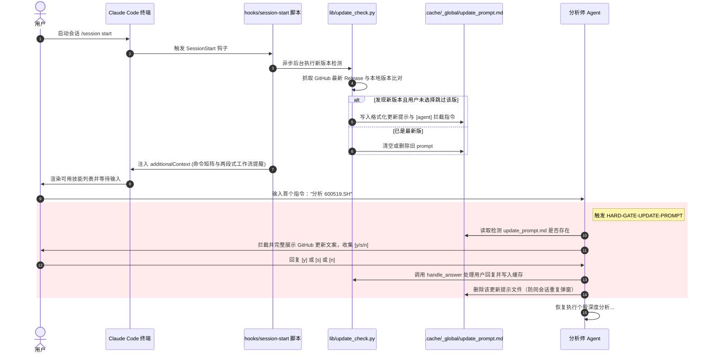

# 游资（UZI）Skills 个股深度分析引擎架构与体系指南 (v3.7.1 升级版)

> **"51 个投资大佬帮你看盘，巴菲特和赵老哥终于坐在了同一张桌子上。"**
>
> UZI-Skill（`wbh604/UZI-Skill`）是一个基于大语言模型与量化分析的个股深度分析引擎。通过集成 22 维免费数据源、17 种华尔街机构分析模型，并由 65 位不同风格的投资大佬（v3.7.1 升级）组成评审团打分，最终生成 600KB 左右的 Bloomberg 风格 HTML 报告、微信群战报和朋友圈分享图。
>
> 本指南对 UZI-Skill 的整体运行体系、SessionStart Hook 与更新拦截机制、两段式执行体系、三档思考深度、15 个 Slash 命令行、4 大核心 Skills、65 位评委人设与 9 大评审流派、以及其核心依赖文档进行全景式的深度梳理。

---

## 一、 UZI-Skill 系统 Hook 与启动自升级机制

UZI-Skill 紧密集成于 Claude Code 平台，利用其生命周期 Hooks 和增量缓存，实现了智能启动注入与无缝的版本自升级防护。



### 1. SessionStart Hook 绑定与上下文注入
在 [`.claude-plugin/hooks.json`](file:///.claude-plugin/hooks.json) 中，系统声明了在会话启动（`SessionStart`）时调用 [`hooks/session-start`](file:///hooks/session-start) 脚本。该脚本会执行两个核心任务：
*   **追加上下文（`additionalContext`）**：在终端注入 UZI-Skill 当前版本加载成功的状态、15 个交互式 Slash 命令行矩阵、以及两段式分析步骤的强提醒。
*   **后台静默检测更新**：开启一个后台异步子进程，运行 [`lib/update_check.py`](file:///skills/deep-analysis/scripts/lib/update_check.py)。

### 2. 自动更新检查与版本门控 (`HARD-GATE-UPDATE-PROMPT`)
*   **后台检测机制**：`update_check.py` 会读取本地的 [`.claude-plugin/plugin.json`](file:///.claude-plugin/plugin.json) 提取 `version`，并向 GitHub API 发送请求获取最新 Release。为防止 GitHub API 限流，检测结果会被缓存 6 小时。
*   **版本隔离与跳过机制**：支持“跳过本版（`skip`）”逻辑。若用户选择跳过 `vX.Y.Z`，本地状态文件 `update_check.json` 会记录 `skipped_version`，在下一次 GitHub 释出更新前，同一版本不会再重复提示。
*   **强硬拦截门控（Gating）**：若发现新版本，后台会在 `.cache/_global/update_prompt.md` 写入提示文案。分析师 Agent 受到 `HARD-GATE-UPDATE-PROMPT` 的物理规则强力约束：**在第一次响应用户的任何查询前，必须先读该文件**。如果存在，必须将更新说明展示给用户，并通过 `AskUserQuestion` 收集用户回答：
    *   `y`：展示不同客户端（Claude Code, Git Pull, Hermes）对应的更新指令，并继续分析。
    *   `s`：调用 `mark_skipped()` 标记跳过此版，缓存记录，后续不再提示，继续分析。
    *   `n`：本次跳过，下次启动会话再提醒。
    处理完成后，必须删除 `.cache/_global/update_prompt.md` 以实现会话内单次拦截。

---

## 二、 两段式核心执行体系与数据流拆解

UZI-Skill 采用**“脚本负责客观算数，Agent 负责定性推理和决策”**的设计。整个分析过程物理上被切分为两个独立阶段，中间必须有 Agent 的主观分析介入，否则将退化为无灵魂的规则拼凑。

### 1. 核心数据流全景图

```mermaid
graph TD
    classDef script fill:#f9f9f9,stroke:#333,stroke-width:1px;
    classDef agent fill:#e1f5fe,stroke:#03a9f4,stroke-width:2px;
    classDef gate fill:#ffebee,stroke:#f44336,stroke-width:2px;

    Start["🚀 用户输入 /stock-deep-analyzer:analyze-stock [Ticker]"]
    
    %% Stage 1
    subgraph Stage 1 [Stage 1: 自动数据与量化计算阶段]
        RunStage1["运行 rrt.stage1()"]:::script
        FetchData["22 维数据源并发采集<br/>(Basic, Kline, Financials, LHB, Sentiment...)"]:::script
        ComputeModels["17 种机构模型计算<br/>(DCF, Comps, LBO, 3-Statement, Porter...)"]:::script
        RuleEngine["65位评委量化规则匹配<br/>(生成 panel.json 骨架分)"]:::script
        
        RunStage1 --> FetchData --> ComputeModels --> RuleEngine
    end

    Start --> Stage 1
    RuleEngine --> Pause["⏸️ 暂停 (等待 Agent 主观分析介入)"]
    
    %% Agent Intervention
    subgraph Agent_Inter [Agent 介入: 定性重构与角色扮演]
        CheckData["(1) 数据质量自审 & 异常清除<br/>(对照 _review_issues.json 剔除搜索噪音)"]:::agent
        Playwright["(2) Headless 浏览器兜底补全<br/>(调用 autofill_via_playwright())"]:::agent
        Qualitative["(3) 6 维定性深钻 (Macro/Industry/Materials...)<br/>(并行派生 3 个子 Agent)"]:::agent
        RolePlay["(4) 65 位大佬 Role-play 打分<br/>(参考 personas/*.yaml 与 5.9万字语料库)"]:::agent
        WriteAnalysis["(5) 叙事合成与 override<br/>(合成 Great Divide 辩论 + 5维 Buy Zones)"]:::agent
        
        CheckData --> Playwright --> Qualitative --> RolePlay --> WriteAnalysis
    end

    Pause --> Agent_Inter
    WriteAnalysis --> SelfReview{"🛡️ lib/self_review.py<br/>16项物理自查门禁"}:::gate
    
    %% Stage 2
    subgraph Stage 2 [Stage 2: 报告编译与图形输出]
        RunStage2["运行 rrt.stage2()"]:::script
        MergeData["读取并合并 panel.json + agent_analysis.json"]:::script
        RenderHTML["生成 600KB Bloomberg 风格报告 + WeChat 战报/分享竖图"]:::script
        
        RunStage2 --> MergeData --> RenderHTML
    end

    SelfReview -->|🔴 Fail: 抛出 RuntimeError 拦截| Fix["Agent 修正数据/JSON 字段"]:::agent
    Fix --> SelfReview
    SelfReview -->|🟢 Pass| Stage 2
```

### 2. 第一阶段：自动数据与量化计算 (Stage 1)
当用户输入 `/stock-deep-analyzer:analyze-stock` 后，系统在后台执行 `run_real_test.py::stage1()`。该步骤为纯脚本化执行：
1.  **22 维数据源并发采集 (Waves 1-3)**：
    *   **Wave 1 (基础必达项)**：`0_basic` (行情)、`1_financials` (三张表指标)、`2_kline` (历史 K 线与动量指标)、`10_valuation` (历史 PE/PB 百分位)。
    *   **Wave 2 (深度基本面/舆情项)**：`3_macro` (宏观指标)、`4_peers` (同行竞争)、`5_chain` (上下游供应链)、`7_industry` (行业空间)、`8_materials` (成本原材料)、`9_futures` (期货关联)、`11_governance` (公司治理)、`12_capital_flow` (资金流向)、`13_policy` (政策监管)、`15_events` (重大公告/事件)、`16_lhb` (龙虎榜席位)、`17_sentiment` (散户/大 V 舆情)、`18_trap` (杀猪盘特征)。
    *   **Wave 3 (特殊持仓/相关度项)**：`6_similar` (高相关度股票对标)、`14_moat` (护城河分析)、`19_contests` (雪球/实盘比赛大佬持仓)。
    系统内置了线程池，并针对 `mini_racer` V8 引擎在 Linux/Mac 下的多线程崩溃风险设置了共享锁（Mutex Lock），对不稳定的 `push2.eastmoney` API 设置了 90 秒的超时容错，且每 3 个维度自动执行增量保存（`--resume`），防范网络故障导致的数据丢失。
2.  **17 种机构级建模与压力测试**：
    *   读取 [`lib/fin_models.py`](file:///skills/deep-analysis/scripts/lib/fin_models.py)，基于 A 股/港股/美股的默认资本成本假设（无风险利率 `rf=2.5%`，股权风险溢价 `ERP=6.0%`，企业所得税 `25%`，高新税率 `15%`）进行自动计算。
    *   输出**三大衍生模块**（作为 `raw_data.json` 的 `dim 20/21/22`）：
        *   **DCF 估值与 5×5 敏感性矩阵**：计算 WACC，输出折现率与终值增长率 $g$ 的敏感性热力图。
        *   **LBO 杠杆收购买方视角压力测试**：以买方 IRR（内部收益率）反向评测当前股价下的安全边际。
        *   **三表联动预测模型**：底层的 IS/BS/CF 五年 bottom-up 联动预测。
3.  **规则引擎骨架打分**：
    *   读取 [`lib/investor_criteria.py`](file:///skills/deep-analysis/scripts/lib/investor_criteria.py)，将 108 个标准化特征输入规则引擎。通过 180+ 条量化逻辑规则，对 65 位评委进行初步的亮灯评判，生成一份基础的 `panel.json` 骨架分文件。

### 3. 中间暂停：Agent 主观介入分析 (The Qualitative & Roleplay Pivot)
在 Stage 1 自动跑完后，脚本暂停。**此时，分析师 Agent 必须根据以下五个子步骤接管整个 pipeline**，不能直接执行 Stage 2：

#### 📌 步骤 A：数据质量自审与过滤
读取 `.cache/{ticker}/_review_issues.json`，检查由于 DuckDuckGo 搜索或 API 乱码带来的垃圾数据（例如：搜“华工科技”时混入了“武汉旅游攻略”）。一旦发现内容风马牛不相及，Agent 必须调用 `WebSearch` 或 `mx_api` 重搜并进行内存数据替换，确保“垃圾数据不进报告”。

#### 📌 步骤 B：Playwright 浏览器主动兜底
Agent 须主动检查 `.cache/_global/network_profile.json` 中本机会话的网络状态，如果发现由于接口反爬导致部分关键数据字段（如 PE 历史分位、原材料成本比例）为 `—`，且 `_review_issues.json` 中报出 Warning，Agent **必须主动调用** [`lib/playwright_fallback.py::autofill_via_playwright()`](file:///skills/deep-analysis/scripts/lib/playwright_fallback.py)，启动 headless 浏览器模拟人手登录雪球或东方财富，直刷 F10 补齐缺失值。

#### 📌 步骤 C：派生 3 个子 Agent 开展 6 维定性深度分析
由于宏观、行业、原材料、期货、政策、事件 6 个维度无法通过量化脚本直接提取有深度逻辑的结论，分析师 Agent 必须**并行派生 3 个子 Agent** 执行深度尽职调查：
*   **Sub-agent A (Macro-Policy)**：负责分析 `3_macro` 与 `13_policy`，寻找利率/地缘政治政策与企业盈利的敏感度传导。
*   **Sub-agent B (Industry-Events)**：负责分析 `7_industry` 与 `15_events`，追踪行业集中度 CR4/CR8 变化、重大合同的中标货币化影响，以及核心子公司独立上市的分部估值（SOTP）。
*   **Sub-agent C (Cost-Transmission)**：负责分析 `8_materials` 与 `9_futures`，进行原材料价格变动时毛利率的敏感性分析（+10% / +20% 下的毛利率变动），并抓取企业年报中的金融衍生品套保敞口。

所有子 Agent 数据回传后，合并写入 `agent_analysis.json` 的 `qualitative_deep_dive` 字段，要求**合计包含至少 3 条跨域因果链**（例如：地方财政吃紧 $\rightarrow$ 城投结算周期拉长 $\rightarrow$ 本股应收账款计提增加 $\rightarrow$ 扣非后净利润受损）。

#### 📌 步骤 D：65 位大佬的 Role-play 评审与打分重写
分析师 Agent 必须根据 65 位投资大佬的 YAML 人设文件（位于 `personas/*.yaml`，如 `buffett.yaml` / `munger.yaml` / `zhao_lg.yaml`），配合 5.9 万字的真实公开言论语料库（`quotes-knowledge-base.md` 和 `serenity-voice.md`）进行分组扮演。
*   **覆盖或调整分数**：对于 12 位旗舰版大佬（Flagship Personas），Agent 必须强引用其 `key_metrics` 白名单字段并使用其标志性的语气（如芒格的“心理学认知偏误”、木头姐的“Wright 递减律”）。当 Agent 的主观打分与规则引擎的量化初筛分数相差超过 30 分时，须在 `panel_insights` 中明确批注“分歧点”。

#### 📌 步骤 E：叙事合成与 Override
Agent 需把多空双方观点梳理成 3 轮多空互喷辩论（Great Divide），汇总 4 维建仓价格区间（Buy Zones），最终写入 **`agent_analysis.json`**：
*   `dim_commentary`：为至少 5 个维度（标准模式下要求全部 22 维）写入每条 $\ge 20$ 字的具体定性评论。
*   `great_divide_override`：多空对决 Punchline 金句（$\ge 10$ 字）和 3 轮辩论文本。
*   `narrative_override.buy_zones`：必须包含价值派（`value`）、成长派（`growth`）、技术派（`technical`）、游资派（`youzi`）四个关键价位及计算理由。

### 4. 第二阶段：报告编译与验证门禁 (Stage 2)
当 Agent 确认已将 `agent_analysis.json` 完整写入且设置 `"agent_reviewed": true` 后，即可调用 `run_real_test.py::stage2()`：

1.  **🛡️ 16 项物理级自检门禁 (`self_review.py`)**：
    在编译成 HTML 前，系统强制调用 [`lib/self_review.py`](file:///skills/deep-analysis/scripts/lib/self_review.py) 对中间生成的数据契约进行 16 项断言校验。如果命中 **Critical 级别**，会强制拦截并抛出 `RuntimeError`，阻断报告生成，逼迫 Agent 重新核实并重写：
    
    | 校验方法名 | 严重度 | 监控点与防范 BUG 历史 |
    | :--- | :--- | :--- |
    | `check_industry_mapping_sanity` | 🔴 Critical | **行业错配校验**：防范 BUG#R10（有色金属股被误映射到“农副食品加工”）。 |
    | `check_all_dims_exist` | 🔴 Critical | **维度缺位校验**：防止由于网络超时造成 Wave2 维度数据缺失。 |
    | `check_empty_dims` | 🔴 Critical | **空值校验**：有维度 key 但 data 为空（排除 lite 模式下未开启维度）。 |
    | `check_hk_kline_populated` | 🔴 Critical | **港股 K 线校验**：防范 BUG#R8（港股 Kline 无 fallback 返回空数据）。 |
    | `check_hk_financials_populated` | 🔴 Critical | **港股财报校验**：防范 BUG#R7（港股财务无 indicators 产生空 stub）。 |
    | `check_panel_non_empty` | 🔴 Critical | **评委席完整度**：判定评委数和平均得分，防分数溢出或全 skip。 |
    | `check_coverage_threshold` | 🔴 Critical | **数据覆盖率**：Critical 校验项通过率低于 60%（CLI 模式降为 warning）。 |
    | `check_placeholder_strings` | 🔴 Critical | **防偷懒占位符**：文件中绝对禁止出现 `[脚本占位]` 或 `[待补充]`。 |
    | `check_agent_analysis_exists` | 🔴 Critical | **Agent 介入校验**：`agent_analysis.json` 缺失或 `agent_reviewed` 不为 true。 |
    | `check_valuation_sanity` | 🟡 Warning | **估值逻辑偏差**：DCF 估值或 Comps 计算结果全为 0。 |
    | `check_metals_materials_populated` | 🟡 Warning | **特定板块缺失**：有色金属、采矿板块原材料成本表为空。 |
    | `check_industry_data_coverage` | 🟡 Warning | **定性行业缺失**：`7_industry` 缺乏 TAM 增速数据，提示重构。 |
    | `check_factcheck_redflags` | 🟡 Warning | **幻觉防范**：检测 commentary 里是否编造了未在 raw_data 中出现的事实（例如药明康德关联苹果订单）。 |

2.  **HTML 独立编译与输出**：
    自检全部通过后，脚本通过 `inline_assets.py` 将 JS/CSS 和 SVG 头像资产全部打包进单个独立 HTML 文件，并调用 `render_share_card.py` 和 `render_war_report.py` 生成便于微信分享的战报图片。

---

## 三、 三档思考深度对比 (Thinking Depths)

UZI-Skill 允许通过命令行 `--depth` 或环境变量 `UZI_DEPTH` 调整分析粒度，在耗时与精准度之间进行灵活调度：

| 对比维度 | ⚡ **lite** (极速速判) | 📊 **medium** (标准深度) | 🔬 **deep** (投委会机构级) |
| :--- | :--- | :--- | :--- |
| **预计耗时** | 1 - 2 分钟 | 5 - 8 分钟 | 15 - 20 分钟 |
| **数据采集维数** | 仅 Wave 1 的 7 个核心维度 | 完整 22 个维度 | 22 维度 + 强化网页 Fallback |
| **评委参与人数** | 10 位核心代表评委 | 65 位完整评审团 | 65 位完整评审团 |
| **量化估值建模** | 仅运行 DCF 估值 | 运行全部 17 种估值模型 | 17 模型 + 分主营业务 bottom-up 预测 |
| **定性搜索限制** | 禁用 DDGS 搜索 | 限制 30 次定性 Web 搜索 | 跑满定性搜索限制 (60次+) |
| **Playwright 兜底** | 物理禁用 | 手动声明或判定后启动 | 默认强制运行，进行 10 维深度直爬 |
| **多空辩论模式** | 不展示多空辩论 | 基础版 Bull-Bear 3 轮辩论 | 定制版 3 轮辩论 + 成员针对性反驳 |
| **自检门槛级别** | 仅拦截 Critical 项，Warning 略过 | 两级自检，Warning 可 Ack 解释 | 两级校验均升级为 Critical 级硬阻断 |
| **最佳应用场景** | 随手速读、板块粗筛、大面积扫雷 | 日常研报撰写、行业分析对标 | 投委会备案、建仓前深度扫雷、排雷 |

---

## 四、 65 人评审团：9 大流派角色全景

评审团目前扩展至 **65 位投资人**，划分为 **9 大流派 (Group A - I)**。

### 1. 流派结构与代表人物

```markdown
Group A: 经典价值派 (6人) · 🟢 稳健/保守风格
  └ 代表: 巴菲特、芒格、格雷厄姆、费雪、邓普顿、卡拉曼
  └ 关注点: ROE 连续 10 年 > 15%、安全边际、护城河（Moat）、低负债。

Group B: 成长投资派 (9人) · 🟣 前沿/颠覆风格
  └ 代表: 林奇、欧奈尔(CANSLIM)、彼得·蒂尔、木头姐(Cathie Wood) + 新晋 5 巨头 (马克·安德森a16z, 比尔·格利, 纳瓦尔, 布拉德·格斯特纳, 查马斯)
  └ 关注点: PEG < 1.0、二三阶颠覆性技术、指数增长、TAM 想象空间。

Group C: 宏观对冲派 (7人) · 🟠 宏观/周期风格
  └ 代表: 索罗斯(反身性)、达里奥(宏观债期)、马克斯(周期钟摆)、德鲁肯米勒、罗伯逊 + 做空猎手 (迈克尔·伯利, 吉姆·查诺斯)
  └ 关注点: 利率环境、地缘政治、做空敞口、大宗传导链、脆弱性。

Group D: 技术趋势派 (4人) · 🔵 动量/趋势风格
  └ 代表: 利弗莫尔(Jesse Livermore)、米内尔维尼、达瓦斯(箱体理论)、江恩
  └ 关注点: 均线排列、Stage 2 突破、右侧成交量配合、相对强度指数。

Group E: 中国价投/公募派 (7人) · 🟢 本分/长期风格
  └ 代表: 段永平、张坤、朱少醒、谢治宇、冯柳、邓晓峰 + 长期主义代表 (高瓴张磊)
  └ 关注点: 商业模式（好生意）、管理层诚信（好人）、合理估值（好价）、中国市场环境。

Group F: A 股游资流派 (23人) · 🔴 短线/格局风格 (仅 A 股激活，港美股置 skip)
  └ 代表: 赵老哥、章盟主、炒股养家、陈小群、呼家楼、方新侠、拉萨天团 + 2025新晋 (六一中路, 流沙河, 古北路, 北京炒家, 瑞鹤仙, 鑫多多)
  └ 关注点: 龙虎榜席位（LHB）、板上博弈、题材辨识度、市场情绪、连板基因。

Group G: 量化系统派 (4人) · ⚪ 客观/冷血风格
  └ 代表: 西蒙斯、索普、大卫·肖 + 因子量化先锋 (克利夫·阿斯尼斯AQR)
  └ 关注点: 多因子暴露（价值/动量/质量/低波动）、因子交叉验证。

Group H: 科技领袖派 (4人) · 🟣 产业视角 (v3.7.0 新增)
  └ 代表: 黄仁勋(Nvidia)、马斯克(Tesla)、山姆·奥特曼(OpenAI)、迈克尔·塞勒(MSTR)
  └ 关注点: AI 算力供应链、CUDA 生态锁定、高定价权、算力消耗系数。

Group I: AI 卡位/瓶颈猎手 (1人) · 🔵 卡位/逆共识风格 (v3.7.0 新增)
  └ 评委: Serenity (@aleabitoreddit)
  └ 关注点: AI 供应链「卡脖子/不可替代」咽喉节点。微盘/小盘垂直垄断商。
```

---

### 2. 重磅评委深度起底：Group I - Serenity

作为 v3.7.0 新增的旗舰评委，**Serenity** 是整个引擎中最具特色和定性辨识度的人物。

*   **人设信念**：前 AI 研究科学家、半导体/光通信工程师。其核心理念是 **“我不买 Nvidia，我只买 Nvidia 没它就无法运转的公司（Strait-of-Nvidia 咽喉理论）”**。他看不起死盯着短期 P/E 和 EPS 的传统财务派，认为“估值看的是战略卡位 vs 市值的严重错配”。
*   **卡脖子瓶颈六要素评估法**：
    1.  **不可替代性 (Irreplaceable)**：下游必不可少，缺了它下游整条线直接瘫痪（如 InP 磷化铟衬底之于硅光）。
    2.  **供给极度集中 (Monopoly/Duopoly)**：单一或双寡头绝对控盘（如 $AXTI 与 $SMTOY）。
    3.  **扩产极度缓慢 (Slow to Expand)**：需要长周期的物理反应或晶体生长。
    4.  **微盘/小市值错配 (Grossly Mispriced)**：通常在 $700M 左右的二三线上游微盘，处于机构盲区。
    5.  **市场尚未定价 (Pre-consensus)**：在机构轮动到来之前提前买入。
    6.  **外部硬验证将至 (Hard Validation)**：客户 roadmap 或 CEO 电话会即将证实短缺。
*   **打分偏好**：如果分析标的不沾 AI 或者只是蹭概念的系统集成商，Serenity 会无情判定 `"verdict": "不达标" / "回避"` 并打出低分；对于真正处于光通信原材料、MBE 设备、CPO 核心光源垄断地位的标的，即使利润亏损，他也会打出高分并留下其经典的口头禅：`"comment": "No substrate, no device. gross mispriced, anon. Go long."`。

---

### 3. H 组科技领袖派 (AI CEO) 的角色映射
黄仁勋、马斯克、Altman、Saylor 四位大佬则完全跳出了财务分析师的视野，站在 **CEO 产业集群** 视角做评判：
*   **黄仁勋 (Jensen Huang)**：高度重视是否为 CUDA 算力生态受益者，考量在 AI 算力基建中的“毛利率保护墙”。
*   **马斯克 (Elon Musk)**：关注物理性量产瓶颈、是否符合第一性原理、以及政府管制政策对供应链的冲击。
*   **山姆·奥特曼 (Sam Altman)**：重视算法算力消耗模型、电力配套瓶颈、以及是否被巨头反垄断卡死。
*   **迈克尔·塞勒 (Michael Saylor)**：以 BTC 金融杠杆和资产负债表扩张视角，对具备超级现金流或宏观资产抗通胀能力的重仓公司给出独特评级。

---

## 五、 15 个交互式 Slash 命令行矩阵

UZI-Skill 在 Claude Code/Cursor 中加载后，支持 15 个 Slash 指令。**建议带上 `/stock-deep-analyzer:` 命名空间前缀**：

| 命令名称 | 接受参数 | 思考深度 | 核心产出与逻辑 |
| :--- | :--- | :---: | :--- |
| **`/analyze-stock`** | `<代码/中文名>` | medium | **标准分析入口**。执行 22 维数据抓取、65 评委评审并生成 Bloomberg HTML 报告。 |
| **`/quick-scan`** | `<代码/中文名>` | lite | **30 秒极速扫描**。仅采集 7 维核心指标与代表性评委打分，快速研判是否值得深钻。 |
| **`/scan-trap`** | `<代码/中文名>` | lite | **杀猪盘扫描器**。检索 8 大欺诈信号（如低质量号模板化推荐、VIP群引流），输出风险系数。 |
| **`/dcf`** | `<代码/中文名>` | medium | **DCF 专项估值**。计算 WACC、进行 5×5 折现率/g 值敏感性计算并绘出热力图。 |
| **`/comps`** | `<代码/中文名>` | medium | **同行对标分析**。PE/PB 分位值对标，计算隐含目标价。 |
| **`/lbo`** | `<代码/中文名>` | medium | **LBO 杠杆收购压力测试**。从买方视角评估未来 5 年 IRR。 |
| **`/initiate`** | `<代码/中文名>` | deep | **机构首次覆盖报告**。按高盛/摩根大通格式生成包含首次评级与目标价计算的研报。 |
| **`/ic-memo`** | `<代码/中文名>` | deep | **投委会备忘录**。输出包含 Bull/Base/Bear 三情景概率与回报建模的 8 章节专业 IC 报告。 |
| **`/earnings`** | `<代码/中文名>` | medium | **财报速递解读**。比对财报预期（EPS/Revenue），执行 beat/miss 核心诊断与原因拆解。 |
| **`/catalysts`** | `<代码/中文名>` | medium | **催化剂日历**。提取未来 60 天可能驱动股价的事件并进行定级。 |
| **`/thesis`** | `<代码/中文名>` | medium | **投资逻辑追踪**。监控 5 支柱健康状况。 |
| **`/screen`** | `<代码/中文名>` | lite | **量化初筛**。运行价值、成长、质量、GULP、做空 5 套量化筛选因子。 |
| **`/dd`** | `<代码/中文名>` | deep | **尽调清单 (Due Diligence)**。生成包含 5 大工作流 21 项任务的审计清单。 |
| **`/panel-only`** | `<代码/中文名>` | lite | **只看投票**。跳过定性详细解读，只列出 65 位大佬的亮灯、分数和投票详情。 |
| **`/segmental-model`** | `<代码/中文名>` | deep | **业务拆解 bottom-up 建模**。针对公司各主营业务线独立进行底层的五年增长建模预测。 |

### CLI 直跑脚本参数说明 (运行 `run.py`)
在本地物理 shell 或 CI 容器中，可通过运行 `run.py` 调度整个引擎：
```bash
# 基本运行 (分析贵州茅台)
python run.py 贵州茅台

# 锁定单一流派视角运行 (仅看 F 组 A 股游资观点，其他流派全部 Skip 置灰)
python run.py 002273.SZ --school F

# 多股横向对比模式 (横向对比茅台和五粮液的核心数据与 65 位评委分歧)
python run.py --versus 600519.SH 000858.SZ --depth lite

# 批量组合资产配置分析 (根据 portfolio.csv 中标的与权重计算组合加权健康分)
python run.py --portfolio my_portfolio.csv --depth lite

# 远程模式 (自动开启本地 httpd 服务 + Cloudflare Tunnel 穿透公网，生成扫码即看的 https 链接)
python run.py AAPL --remote
```

---

## 六、 核心底层依赖规范与知识库文档

分析师 Agent 在进行定性介入与角色扮演时，必须依托以下核心文档（Single Source of Truth），严格规范信息输入：

### 1. `quotes-knowledge-base.md` 与 `serenity-voice.md`
*   **内容**：65 位投资人真实的语录、口吻模板及 few-shot 范例。
*   **用途**：Agent 在生成 `panel.json` 的 `comment` 字段前**必须通读此文件**。严禁使用“前景广阔、值得关注”等同质化机器废话，必须精确还原投资人的真实语言风格（例如：段永平只谈“商业模式、对不对、便宜不便宜”；陈小群大谈“一日游、封板力度、核按钮”）。

### 2. `task2.5-qualitative-deep-dive.md`
*   **内容**：详细定义了 3 个并行子 Agent（Macro-Policy, Industry-Events, Cost-Transmission）的 Prompt 模板，以及 6 大定性维度的必答问题清单（如利率敏感度、CR4/CR8、毛利率顺价公式、套保敞口、政策原文 cite 规则）。
*   **用途**：指导子 Agent 爬取证监会、国务院、发改委、生意社和上期所日均价格等精准 URL 数据，并强力校验 3 条以上的跨域因果链。

### 3. `task1.5-institutional-modeling.md`
*   **内容**：列出了机构级估值模型（DCF, LBO, 3-Statement, Comps）的数学定义、默认参数假设，以及针对半导体、消费白马、创新药、钢铁化工等不同行业的假设调整区间（Beta/Growth rate/Terminal g）。
*   **用途**：约束 Agent 在面对高增长半导体股时调高 Beta 和增长速度，在遇到煤炭钢铁股时调低增长假设，并要求将默认 DCF 与行业修正后的 DCF 分歧对比写进报告。

---

## 七、 体系运转闭环定义 (Definition of Done)

只有满足以下条件，一次深度分析才被判定为“已合规完成”：
1.  **产出 6 个核心 JSON 文件**：在 `.cache/{ticker}/` 目录下完整输出 `raw_data.json`、`dimensions.json`、`panel.json`、`agent_analysis.json`、`synthesis.json` 及报告 metadata。
2.  **硬性拦截检查无阻断**：运行 `python review_stage_output.py <ticker>` 返回 `exit 0`，没有 Critical 级报错，Warning 均在 `review_acknowledged` 中写明了 Ack 理由。
3.  **主观分析与 Role-play 覆盖**：`agent_analysis.json` 真实存在，其内部 `"agent_reviewed": true` 标志为真；`dim_commentary` 中定性评语覆盖了应评维度，字数达标且包含真实的数字引用；多空辩论（Great Divide）、四大流派建仓价（Buy Zones）均有明确计算。
4.  **报告编译成功**：成功在 `reports/{ticker}_{date}/` 下输出大于 400KB 的 standalone HTML 报告，控制台（console）无 JavaScript 报错。
