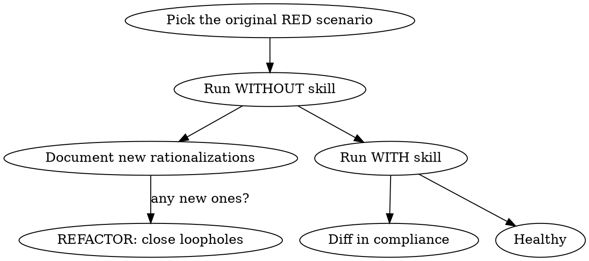

# Skill Health

## Overview

A skill is healthy if (a) an agent that loads it **complies** under pressure, and (b) it stays small and focused. Health is not the same as "it's still on disk" — every shipped skill gradually drifts: agents find new rationalizations, context budgets shift, the surrounding ecosystem changes.

This skill defines a periodic, evidence-based health check for any skill in the workspace. The deliverable is a one-page health report with a verdict (`Healthy` / `Drift` / `Bloat` / `Retire`).

## When to Use

Use this skill when **any** of the following triggers fire:

- An agent reports a skill "didn't help" or "felt wrong" on a real task.
- The skill's underlying tool / framework / library has changed.
- A `rationalization table` is being added in a sibling skill (cross-check).
- Quarterly / half-year review tick.
- Before promoting a skill from "draft" to "blessed" in the team.

**Don't use** to evaluate a brand-new skill (use `writing-skills` GREEN phase for that) or to fix the skill itself (use `writing-skills` REFACTOR phase after a failing baseline).

## Core Methodology

A health check is RED-GREEN for the skill's continued fitness, with three extra axes.

### 1. Compliance Audit (Did the skill actually move behavior?)

Re-run the **baseline scenario** that produced the original RED. Concretely: pick a representative subagent, drop the skill from its context, and run the scenario. Then re-run with the skill. The diff between the two outputs is the skill's residual value.



If the agent now complies **without** the skill, the skill has been absorbed by the model's general behavior — candidate for retirement.

### 2. Rotation Check (Is the skill still pointing where it should?)

| Signal | Check | Verdict hint |
|---|---|---|
| External URLs / tool names | Are they still valid? Last verified date? | Outdated link → `Drift` |
| Referenced framework versions | Match the version the project actually uses? | Mismatch → `Drift` |
| Referenced sibling skills | Do those skills still exist? Are they still authoritative? | Stale ref → `Drift` |
| Audience-based language | `description` in routing Claude's language; body in human reader's; code in English | Mixed → `Drift` |

### 3. Bloat Check (Has the skill outgrown its context budget?)

Target word counts (from `writing-skills`):

| Skill class | Target | Soft cap |
|---|---|---|
| Getting-started workflows | < 150 | 200 |
| Frequently-loaded skills | < 200 | 250 |
| Other skills | < 500 | 800 |

```bash
wc -w path/to/SKILL.md
```

Over the soft cap → split into `SKILL.md` (overview + decision tree) + `references/<topic>.md` (heavy reference), and link from `SKILL.md`.

### 4. Rationalization Drift

If the skill is a discipline-enforcing skill (TDD, verification-before-completion, etc.), re-read its rationalization table. Are the listed excuses still the **highest-frequency** excuses agents actually use? If not, refresh the table from fresh baseline runs.

## Verdict

| Verdict | Meaning | Next action |
|---|---|---|
| `Healthy` | All axes pass, compliance diff non-zero, bloat within budget | No action. Schedule next check. |
| `Drift` | Rotation check failed OR rationalization table stale | Hand off to `writing-skills` REFACTOR. |
| `Bloat` | Over soft cap | Split. Move heavy reference to `references/`. |
| `Retire` | Compliance diff = 0 AND no new users in 2 quarters | Mark `Deprecated` in `docs/skill-lifecycle.md` §8, point to successor. |

## Quick Reference

| Question | Where to look |
|---|---|
| "Did the skill change behavior?" | Re-run baseline subagent. |
| "Are the URLs / tool names still valid?" | Grep the skill file for `http`, API names, command names. |
| "Is it too long?" | `wc -w`. |
| "Is the rationalization table still relevant?" | Sample 3 recent task transcripts where the skill was loaded. |
| "Should we retire it?" | Compliance diff = 0 AND zero references in last 2 quarters. |

## Common Mistakes

| Mistake | Fix |
|---|---|
| Checking only the file on disk | File exists ≠ skill is effective. Always re-run a baseline. |
| Bloat = "remove prose" | Bloat = move detail to `references/`, not delete. Frontmatter and decision tree stay inline. |
| Retire = delete the file | Retire = mark `Deprecated` with a successor pointer. Deletion loses the audit trail. |
| Health check on a brand-new skill | Wrong tool. Use `writing-skills` GREEN instead. |
| Skipping the cross-skill rotation check | If a referenced skill was renamed or moved, this one silently rots. |

## Required Background

- `superpowers:writing-skills` — to know what a "compliant skill" looks like, what the RED-GREEN-REFACTOR cycle is, and what the iron law means.
- `superpowers:test-driven-development` — to interpret the compliance audit as a TDD test.

## Related Skills

- `writing-skills` — for the actual edit / upgrade work after a `Drift` verdict.
- `pruning-skills` — for the actual removal work after a `Retire` verdict.
- `superpowers:using-superpowers` — for the meta-routing decision of when to load this skill.
