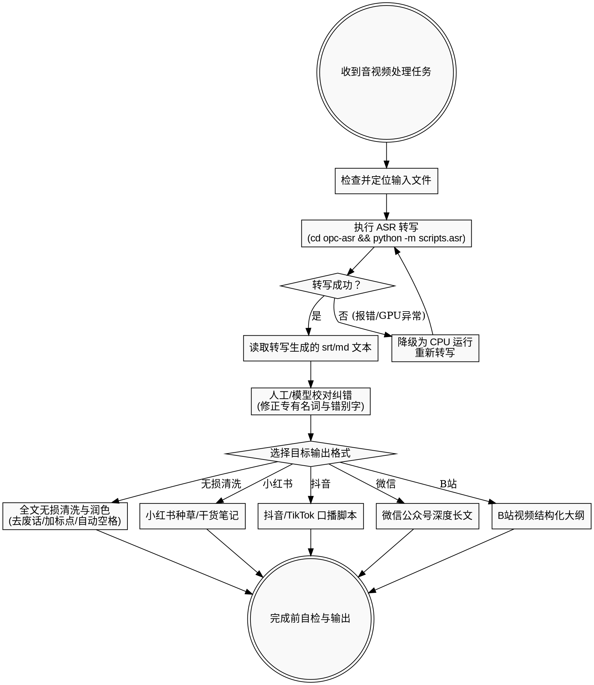

# 视频字幕提取与文案加工

## 概述

本 Skill 旨在调用本地 ASR（语音识别）工具 `/Users/mshengran/Project/opc-asr` 提取音视频的字幕（SRT）或原始文本（Markdown），并通过模型或人工手段进行高阶的文字纠错、全文清洗与多平台文案改写，实现从“原始音视频”到“多平台高质量分发文案”的自动化生产闭环。

## 何时使用

### 适用场景与症状

- 音视频文件需要转写为字幕文件（`.srt`）或 Markdown 笔记（`.md`）。
- ASR 转写出来的文本存在口语填充词、结巴、重复、错别字，需要“无损清洗与润色”。
- 原始转写文本需要根据小红书、抖音/TikTok、微信公众号、B站等不同平台的传播调性重写为定制化脚本或笔记。
- 需要从长时间的演讲、播客或视频课中提炼核心大纲、精选金句以及知识脑图。

### 不适用场景

- 视频直接剪辑、画面转场与视听语言包装（请使用 `video-editing-direction`）。
- 外部热点新闻与行业竞品收集（请使用 `news-gathering`）。

---

## 核心工作流



---

## 快速参考 (Quick Reference)

### 1. 转写环境检测

```bash
# 确认 Python 虚拟环境可用，且已安装 whisper 与 torch 依赖
python -c "import whisper; import torch; print('whisper:', whisper.__version__, 'mps:', torch.backends.mps.is_available())"

# 确认系统包含 ffmpeg 以供提取音轨
which ffmpeg
```

### 2. ASR 核心执行命令

```bash
# 1. 切换到本地 ASR 工具目录
cd /Users/mshengran/Project/opc-asr

# 2. 执行转写（默认生成 srt 字幕，使用 turbo 模型并强制中文识别）
python -m scripts.asr "/path/to/video.mp4" --language zh --model turbo

# 3. 执行转写（生成 Markdown 格式文本，去除时间轴，便于文案加工）
python -m scripts.asr "/path/to/video.mp4" --language zh --model turbo --format md
```

---

## 核心规则与再加工模板

### 1. 全文无损清洗与润色 (Clean & Polish Raw Transcript)

适用于希望**还原完整内容**但需要消除口语瑕疵的场景：

| 规则维度 | 规则要求 |
| :--- | :--- |
| **去除废话** | 自动过滤所有的语气词（如：嗯、啊、那个、就是说、然后）和无意义的重复结巴（如：一个、这个）。 |
| **标点与排版** | 根据语义自动添加正确的标点符号。若表达的是多个并列或递进观点，自动使用列表（Bullet points）进行排版以增强可读性。 |
| **语法修正与润色** | 修正语病、口吃和倒装句，将口语词汇替换为准确的书面表达。**绝不可改变或删减用户的原始核心观点与事实。** |
| **专有名词与多语言** | 准确识别中英文混杂的表达，确保行业术语（如 API, Docker, FastAPI）拼写正确，并**在中英文之间自动增加空格**。 |
| **纯净输出** | **只输出最终处理好的文本**，禁止包含任何“好的，这是为您整理的文本”等开场白、解释性话语或结束语。 |

### 2. 多矩阵渠道重写 (Rewrite & Adaptation)

在清洗与纠错后，根据用户需求执行下列定制化重写逻辑：

| 平台渠道 | 核心重写公式 | 格式与排版要求 |
| :--- | :--- | :--- |
| **小红书笔记** | [利益点 + 痛点场景] 标题 (20字内) | 前 20% 直击痛点；正文使用 Emoji 视觉锚点（✨/💡/📌）分段多空行；结尾 Tag 组合（5-10个）。 |
| **抖音/TikTok 脚本** | [黄金 3 秒钩子] + [快节奏论点] | 台词紧凑，总数控制在 300-500 字，标注 [画面切 B-roll] 等视听设计动作。 |
| **微信公众号长文** | [干货价值 + 深度社交货币] | 使用 Markdown 二级/三级标题建立清晰结构，核心句加粗，保持深度阅读流畅性。 |
| **B站视频大纲** | [章节划分] + [弹幕互动预埋] | 标注 [序章] -> [核心] -> [高潮] 节点，设计 [弹幕预埋点] 并自然嵌入“一键三连”引导。 |

---

## 常见错误与合理化借口 (Common Mistakes & Rationalizations)

### 避坑指南

| 错误做法 | 正确做法 |
| :--- | :--- |
| **直接复制 ASR 原始文本** | 重写前必须纠正 ASR 对人名、品牌名、开发术语的同音错别字（如把 "Next.js" 识别为 "耐克丝特"）。 |
| **直接跨过 ASR 步骤编造文案** | 必须根据 opc-asr 提取出的真实文本进行文案创作，不能脱离事实凭空捏造。 |
| **输出文本中包含解释性废话** | 在要求“纯净输出”时，模型不得擅自输出任何非正文内容的客套说明。 |
| **一稿多投不改语气** | 小红书需注重“体验/语气”，公众号需注重“逻辑/深度”，严禁同一份清洗稿件直接投递所有平台。 |

### 警惕你的合理化想法 (Red Flags)

- *“这个视频录得挺短的，我直接猜它的核心大意重写，不用运行 opc-asr 转写了。”* ── **警告：必须运行转写！不可凭空猜测内容。**
- *“ASR 结果里的错字很少，我可以不用校对直接重写。”* ── **警告：必须校对！错字（如专有名词拼写错误）会破坏文案专业性。**
- *“在文案前面加一句『好的，已为您处理』显得更加友好。”* ── **警告：纯净输出要求下禁止输出任何客套话！**
- *“我为了让文案看起来更有文采，可以把作者原文的部分观点删去。”* ── **警告：清洗润色时绝对不可改变用户的核心观点和意思！**

---

## 产出物清单

- [ ] **ASR 原始转写文本**（包含 `.srt` 字幕文件或 `.md` 转写纯文本）
- [ ] **清洗纠错校对清单**（列出纠错后的核心专有名词，如 `Whisper`、`FastAPI` 等）
- [ ] **全文无损清洗与润色文本**（去除语气助词、标点完整、中英文空格分明、纯净无解释性开场白的正文）
- [ ] **多渠道重写定制稿件**（小红书笔记、短视频口播脚本、微信公众号长文等）
