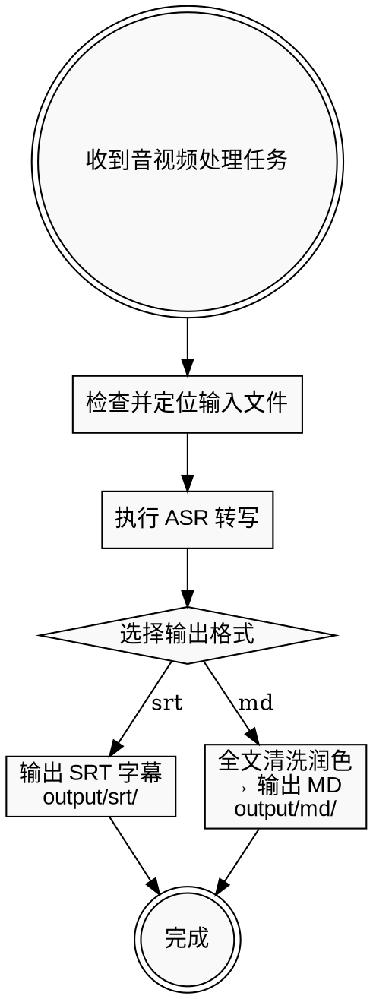

# 视频字幕提取与文案加工

## 概述

本 Skill 调用本地 ASR 工具从音视频中提取文字，提供两种标准化输出：

| 输出格式 | 说明 | 输出目录 |
| :--- | :--- | :--- |
| **SRT 字幕** | 带时间轴的字幕文件，适用于视频配字幕 | `output/srt/` |
| **MD 文案** | 全文无损清洗与润色后的纯文本，无时间轴 | `output/md/` |

## 何时使用

- 音视频需要转写为带时间轴的字幕文件（`.srt`）。
- 音视频需要转写为清洗润色后的全文文案（`.md`），去除口语填充词、结巴重复，补全标点。

---

## 核心工作流



---

## 快速参考

### 1. 环境检测

```bash
python -c "import whisper; import torch; print('whisper:', whisper.__version__, 'mps:', torch.backends.mps.is_available())"
which ffmpeg
```

### 2. 执行命令

```bash
cd /Users/mshengran/Project/opc-asr

# SRT 字幕（带时间轴）→ output/srt/{文件名}.srt
python -m scripts.asr "/path/to/video.mp4" --language zh --model turbo

# MD 全文文案（清洗润色，无时间轴）→ output/md/{文件名}.md
python -m scripts.asr "/path/to/video.mp4" --language zh --model turbo --format md
```

可用 `--output-dir` 自定义输出目录。

#### 输出目录结构

```
output/
├── srt/    ← --format srt（默认）带时间轴字幕
└── md/     ← --format md 清洗润色全文文案
```

---

## MD 文案清洗规则

MD 输出为**全文无损清洗与润色**：将碎片化的分段拼接为语义完整的段落，去除时间轴，消除口语瑕疵。

| 规则维度 | 规则要求 |
| :--- | :--- |
| **合并段落** | 将碎片化分段按语义合并为完整段落，不保留时间轴。 |
| **去除废话** | 过滤语气词（嗯、啊、那个、就是说、然后）和无意义重复结巴。 |
| **标点与排版** | 根据语义补全标点，并列或递进观点使用列表排版。 |
| **语法修正** | 修正语病、口吃和倒装句，口语词汇替换为书面表达。**不可改变原始核心观点与事实。** |
| **专有名词** | 识别中英文混杂表达，确保术语拼写正确，中英文之间自动加空格。 |
| **纯净输出** | 只输出处理好的文本，禁止包含任何开场白、解释性话语或结束语。 |

---

## 避坑指南

| 错误做法 | 正确做法 |
| :--- | :--- |
| 跨过 ASR 步骤直接编造文案 | 必须根据 opc-asr 提取的真实文本加工，不可凭空捏造。 |
| 直接复制 ASR 原始文本不校对 | 必须校对专有名词的同音错别字（如 "Next.js" → "耐克丝特"）。 |
| 在输出中加客套话 | 纯净输出要求下禁止任何非正文内容。 |
| 为追求文采删减原始观点 | 清洗润色绝对不可改变核心观点和意思。 |

---

## 产出物清单

- [ ] **SRT 字幕文件**（`output/srt/`，带时间轴）
- [ ] **MD 全文文案**（`output/md/`，清洗润色后的纯文本，无时间轴）
- [ ] **纠错校对清单**（列出修正的专有名词，如 `Whisper`、`FastAPI`）
